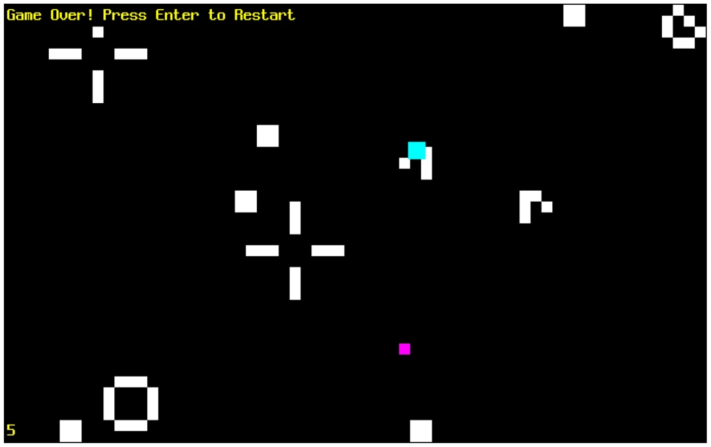

# Web-Playground

This repo is about experimental web projects and studying projects.

## How to play

### By web server.

1. Clone the repo.
2. Launch the web server at repo's root folder.
3. Open browser and go to web game.

### By Electron.

1. Clone the repo.
2. Go to repo's root folder and go to each folder. (ex DodgeLife/ ...)
3. run `npx electron .`

### By executable.

1. Download.
2. Play.

## Dodge the Conway's game of life.

1. Press WASD to move.
2. The Conway's game of life will appear every interval. (Glider, Traffic light.)
3. The game will over when player touches the living cell.
